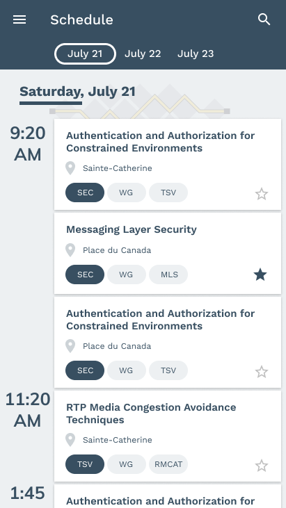

# IETF App 

Application Mobile for the IETF Meetings

- Current state: WIP

## Getting Started

Using Google UI Framework, Flutter, to code once and deploy on both iOS and Android for similar experience.

## Screenshot

<div class="grid" style=" display: flex;  align-items: center;  flex-wrap: wrap;  justify-content: center;">
      
      
      
      
      
      
      
</div>

EndPoint: 
https://datatracker.ietf.org/meeting/XYZ/agenda.json

- XYZ is the IETF Number.
- agenda.json, can be replaced by agenda.csv, agenda.txt to get other file formats.

Endpoint for IETF events:
https://datatracker.ietf.org/api/v1/meeting/meeting/?format=json&limit=25

This endpoint gives the list of events associated with IETF, including 104, 105, 106... etc.
- Useful data items
```
      "agenda_info_note": 
      "agenda_warning_note": "",
      "break_area": "Convention Floor Foyer",
      "city": "Montreal",
      "country": "CA",
      "date": "2019-07-20",
      "days": 7,
      "id": 881,
      "number": "105",
      "proceedings_final": false,
      "reg_area": "Square Dorchester",
      "submission_correction_day_offset": 50,
      "submission_cutoff_day_offset": 26,
      "submission_start_day_offset": 90,
      "time_zone": "America/New_York",
      "updated": "2019-07-20T08:51:17-07:00",
      "venue_addr": "",
      "venue_name": "Fairmont Queen Elizabeth Montreal"
```

Endpoint content guideline:
https://datatracker.ietf.org/meeting/105/materials

This can help to decide which can be hidden or shown in the app.

